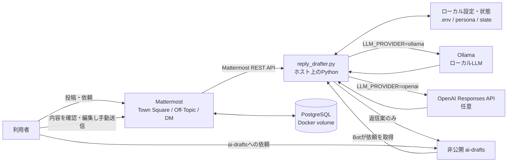

# Mattermost Local Sandbox

ローカルMattermostと、人が確認して返信するAIドラフト機能の検証環境です。

> **用途:** 個人・開発用のローカル検証。会社の本番利用に必要な可用性、監査、アクセス制御、データ保護の設計は含みません。

## 全体像



Botは監視対象の投稿から返信案を作り、`ai-drafts` に出します。`ai-drafts` に書いた人間の依頼にも同じチャンネルで回答案を返します。Botが元のチャンネルやDMへ返信を送ることはありません。

## コンポーネント

| コンポーネント | 役割 | 実行場所 |
|---|---|---|
| Mattermost Team Edition | チャットUIとREST API | Docker |
| PostgreSQL 16 | Mattermostの永続データ | Docker volume |
| `reply_drafter.py` | 投稿の定期確認、文脈収集、ドラフト投稿 | ホスト上のPython |
| Ollama | ローカルでの文章生成 | 任意・ローカル |
| OpenAI Responses API | クラウドでの文章生成 | 任意・外部API |

## 機能

| 機能 | 内容 |
|---|---|
| ローカルチャット環境 | Mattermost、PostgreSQL、Docker Compose。日本語表示とSlack風テーマを適用 |
| デモデータ | Main Teamのチャンネルと擬似ユーザー、初期会話を投入 |
| チャンネル返信案 | `WATCH_CHANNELS` の新着投稿を処理。サンプル設定はTown SquareとOff-Topic |
| DM返信案 | Botが参加したDMのうち、`WATCH_DM_CHANNEL_IDS` に明示したIDだけを処理 |
| 手動AI依頼 | `ai-drafts` に依頼を書くと、回答案を同チャンネルへ投稿 |
| 人による送信 | 内容を確認・編集し、人間が元のチャンネルやDMへ手動で送信 |

## 起動

### 1. Mattermostを起動

初回にロケール、テーマ、デモデータを含めてセットアップする場合（Bash環境が必要）：

先に `.env.example` を `.env` にコピーし、`POSTGRES_PASSWORD`、`DEMO_ADMIN_PASSWORD`、`DEMO_USER_PASSWORD` にそれぞれ異なる英数字のパスワードを設定してください。`.env` はGit管理対象外です。既存のPostgreSQLボリュームを使っている場合、`POSTGRES_PASSWORD` はそのボリュームに設定済みの値を指定してください。

```bash
bash setup.sh
```

Docker Compose環境だけを起動・停止する場合：

```bash
docker compose up -d
docker compose down
```

ブラウザーで [http://localhost:3000](http://localhost:3000) または [http://localhost:8065](http://localhost:8065) を開きます。デモユーザーは `DEMO_USER_PASSWORD`、管理者は `DEMO_ADMIN_PASSWORD` でログインします。ポートはローカルホストに限定しています。**公開・共有環境では使わないでください。**

### 2. Botを設定

MattermostにBotアカウントを作り、監視するチャンネルと非公開 `ai-drafts` に参加させます。Botには必要最小限の権限を設定してください。

```powershell
# 初回のみ: .env.example をコピーし、トークン等を設定
Copy-Item .env.example .env
notepad .env

# PythonでBotを起動
python .\reply_drafter.py
```

既存の `.env` を再利用する場合は上書きしないでください。起動後、Botは既存投稿を読み取り済みにし、その後に届いた投稿から処理します。Botの停止は `Ctrl+C` です。設定を変えた場合は再起動してください。

### 3. 生成先を選択

| `.env` 設定 | 生成先 | 投稿データの送信先 |
|---|---|---|
| `LLM_PROVIDER=ollama` | Ollama（既定 `qwen2.5:14b`） | ローカルPC |
| `LLM_PROVIDER=openai` | OpenAI API（既定 `gpt-6-luna`） | OpenAI Responses API |

OpenAI APIを使う場合は `.env` に `LLM_PROVIDER=openai` と `OPENAI_API_KEY` を設定します。ChatGPTの契約とAPI利用料は別です。APIキーをREADMEやGitHubに書かないでください。

ペルソナを設定する場合は `data/reply-drafter-persona.example.txt` を `data/reply-drafter-persona.txt` にコピーして編集します。個人用ファイルは `.gitignore` 対象で、GitHubへは含めません。

## データとプライバシー

| データ | 処理 |
|---|---|
| 監視対象の投稿と会話文脈 | BotがMattermost APIから読み取る。`CONTEXT_POSTS` 件までを生成時の文脈に含める |
| Ollama利用時 | 設定したローカルOllamaで生成。LLMプロバイダーへの外部送信なし |
| OpenAI API利用時 | 対象投稿、設定した会話文脈、返信者ペルソナをAPIへ送信。Responses APIは `store=false` を指定 |
| 処理状態 | `data/reply-drafter-state.json` に重複防止用の投稿IDを保存。本文は保存しない |
| DM追加文脈 | 必要に応じ `data/reply-drafter-context.json` にローカル保存。含めた投稿文は選択したLLMにも渡る |
| 資格情報・個人設定 | `.env` と `data/reply-drafter-persona.txt` はGit管理対象外 |

OpenAI APIでは、APIデータは明示的にオプトインしない限りモデル訓練に使われず、標準の不正利用監視ログは最大30日保持される場合があります。`store=false` はResponses APIのアプリケーション状態保存を無効にする指定であり、不正利用監視ログの保持を無効にするものではありません。社内データを送信する前に、所属組織の規程とOpenAIの[APIデータ管理](https://developers.openai.com/api/docs/guides/your-data)を確認してください。

## DMを監視する場合

既存の1対1 DMにBotを加えると、相手にもBotが見えるグループDMが新たに作られ、過去の会話は引き継がれません。参加者に共有を確認してから設定してください。

```powershell
python .\reply_drafter.py --list-dms
```

出力された対象DMのIDだけを `.env` の `WATCH_DM_CHANNEL_IDS` にカンマ区切りで設定し、Botを再起動します。空欄ならDMを監視しません。

## 主な設定

| 変数 | 用途 | 既定値 |
|---|---|---|
| `MATTERMOST_URL` | MattermostのURL | `http://localhost:3000` |
| `MATTERMOST_BOT_TOKEN` | Botアクセストークン | 必須 |
| `WATCH_CHANNELS` | チーム名とチャンネル名の監視一覧 | `main-team:town-square,main-team:off-topic` |
| `WATCH_DM_CHANNEL_IDS` | 許可するDMのID一覧 | 空（監視なし） |
| `DRAFTS_CHANNEL` | ドラフトと依頼の入出力先 | `main-team:ai-drafts` |
| `LLM_PROVIDER` | `ollama` または `openai` | `ollama` |
| `OLLAMA_URL` / `OLLAMA_MODEL` | ローカルLLMのURLとモデル | `http://127.0.0.1:11434` / `qwen2.5:14b` |
| `OPENAI_API_KEY` / `OPENAI_MODEL` | OpenAI APIキーとモデル | 空 / `gpt-6-luna` |
| `OPENAI_REASONING_EFFORT` / `OPENAI_MAX_OUTPUT_TOKENS` | 推論量と出力上限 | `low` / `800` |
| `POLL_SECONDS` / `CONTEXT_POSTS` | 監視間隔（秒）と文脈件数 | `5` / `8` |
| `REPLY_PERSONA_FILE` | ローカルのペルソナファイル | `data/reply-drafter-persona.txt` |

## 制約

- Botが参加して読み取りできるチャンネルのみ監視できます。
- 監視開始時点より前の投稿は処理しません。
- 再起動時は保存済みカーソルまでページを遡って新着投稿を取得します。生成に失敗した投稿はカーソルを進めず次回再試行します。
- `ai-drafts` は依頼入力用にもなるため、人間の新規投稿は回答生成を起動します。Bot自身の投稿には反応しません。
- AIは回答案を `ai-drafts` に投稿するだけです。元投稿への返信・送信は人が行います。
- このサンドボックスは、本番向けの認証強化、監査、障害復旧、秘密管理を提供しません。

## 次の機能拡張案（未実装）

まずは返信スタイルの選択・上書きと評価方法を整え、その後に知識連携や運用機能を追加する案です。

| 優先度 | 拡張案 | ねらい・設計上のポイント |
|---|---|---|
| 1 | **返信スタイルの振り分け** | 受信内容を高速・低コストな分類器（小型LLMやルール方式など）で「丁寧」「論理的・技術的」「事務的・明確」に分類してから生成LLMへ渡す。曖昧なら標準の丁寧な文体にする。 |
| 1 | **人によるスタイル指定** | `ai-drafts` で「丁寧に」「論点を整理して」などの指定を受け付け、自動判定より優先する。誤分類の修正にも使う。 |
| 1 | **強めの返信の安全な定義** | 人や相手の性格を分類せず、必要な場合だけ「未回答事項・事実・期限・次のActionを明確にする」文体を選ぶ。侮辱・脅し・人格評価は出さない。 |
| 2 | **品質評価と回帰確認** | 匿名化した例文で、スタイル選択、事実の正確さ、推測の有無、読みやすさを評価する。分類器やプロンプトを変えた時に品質低下を検知する。 |
| 2 | **スレッド文脈の改善** | 返信対象のスレッドを優先して文脈に含め、取得範囲・最大文字数・除外ルールを設定可能にする。DMは明示的に許可したものだけを対象にする。 |
| 3 | **承認済み資料の検索** | 社内FAQや承認済み設計資料など、明示的に選んだ資料だけを参照し、回答案に根拠リンクを付ける。未確認の社内情報を推測で補わない。 |
| 3 | **運用・コストの可視化** | API呼び出し数、概算コスト、処理時間、失敗数を本文や秘密情報なしで記録し、タイムアウト・再試行・モデル切替を管理する。 |

### スタイル分類の実装方針案

- 分類結果は自由文ではなく、`polite` / `logical` / `firm_factual` のような固定カテゴリで返す。
- 判定理由は短くし、相手の意図や性格を断定しない。確信度が低い場合は標準スタイルを使う。
- 人が指定したスタイルは自動判定より優先し、ドラフトに選択スタイルを表示する。
- 分類器の候補（小型LLM、ルール、指定されたJev等）は、精度・応答時間・費用・社内データの送信先を比較してから決める。
- どのスタイルでも、生成案は `ai-drafts` に留めて人が確認・送信する。

ここに記載した案は未実装です。まずは「分類＋手動上書き＋匿名化した評価例」を小さく試し、実際の応答品質と追加コストを見てから次の段階を決めるのがよさそうです。

## リポジトリ内の主なファイル

| ファイル | 内容 |
|---|---|
| `docker-compose.yml` | MattermostとPostgreSQL |
| `setup.sh` | 初期設定、デモアカウント、テーマ、ロケール |
| `seed_data.py` | デモ会話の投入 |
| `reply_drafter.py` | ローカルLLM / OpenAI APIによる返信案生成 |
| `.env.example` | 設定テンプレート（秘密情報は含めない） |
| `data/reply-drafter-persona.example.txt` | ペルソナの記入例 |
